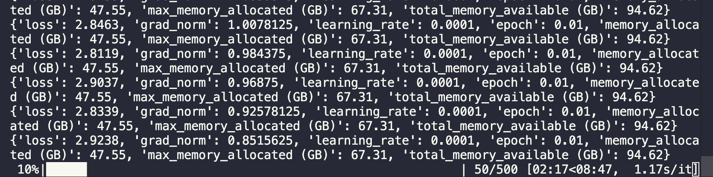
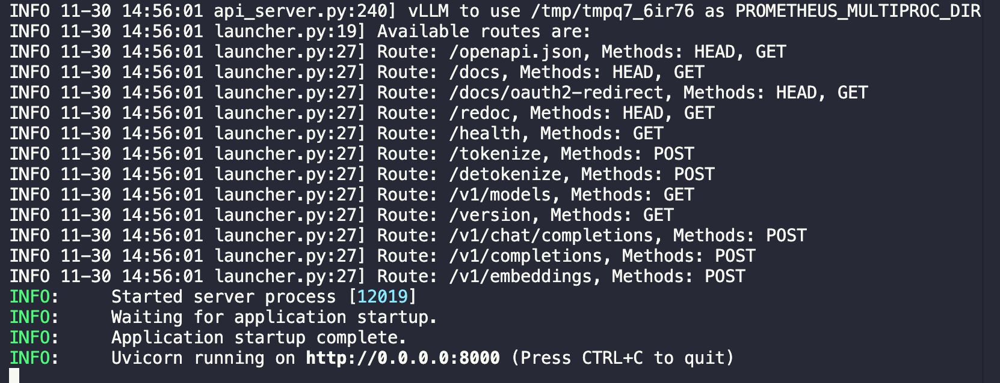
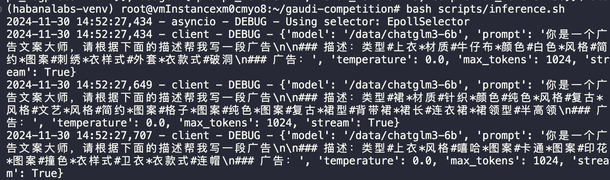

# gaudi-competition
CCF contest

## 配置环境

申请好虚拟机资源后首先需要配置环境，以及下载模型和数据集，本项目基于 `1.18` 的驱动进行开发，虚拟机默认镜像的驱动是 `1.17`，因此需要花一段时间来进行升级（注意升级过程中是否有因为网络问题而报错）

```bash
bash scripts/install_env.sh
```

## Lora 微调

使用预定义好的参数进行 `Lora` 微调，微调完成后的模型文件保存在 `/data/chatgml3-6b-lora`

```bash
bash scripts/finetune.sh
```

运行结果如下图所示：



## 模型推理

模型推理基于 `vllm` 进行，需要先启动 `vllm` 推理服务器

```bash
# 如何需要取消 warmup 过程，可在运行前添加 export VLLM_SKIP_WARMUP="true"
bash scripts/run_vllm_server.sh
```

当出现下面图片所示表示 `vllm` 启动成功：



使用 `curl` 命令测试 `vllm` 模型服务器是否能够正常推理

```bash
curl http://localhost:8000/v1/completions \
-H "Content-Type: application/json" \
-d '{
  "model": "/data/chatglm3-6b",
  "prompt": "请从 1 数到 10：1，2",
  "max_tokens": 150,
  "temperature": 0.7
}'
```

使用脚本文件对数据集中的 `dev.json` 进行推理，运行 [inference.sh](inference/inference.py)

```bash
bash scripts/inference.sh
```

若运行成功，对应的运行效果如图所示：


可以自行修改推理脚本的参数，在请求速率为 5 req/s 时，对应测试的结果为：

```bash
==================== 推理性能测试结果 ====================
推理总耗时 (s)：                               232.09
请求成功数量：                                  1038
总的输入 Token 数量：                           40982
总的生成 Token 数量：                           252943
请求吞吐率 (req/s):                           4.47
新生成 Token 吞吐率 (tok/s):                   1089.84
总 Token 吞吐率 (tok/s):                     1266.42
--------------------首包延迟（TTFT）--------------------
首包延迟平均值 (ms):                            757.40
首包延迟中位数 (ms):                            30.93
首包延迟 P50  (ms):                          22.30
首包延迟 P90  (ms):                          22.52
首包延迟 P99  (ms):                          22.53
-------------------端到端延迟（E2EL）--------------------
端到端延迟平均值 (ms):                           5131.57
端到端延迟中位数 (ms):                           1985.33
端到端延迟 P50  (ms):                         82.05
端到端延迟 P90  (ms):                         88.92
端到端延迟 P99  (ms):                         89.39
==================================================
```